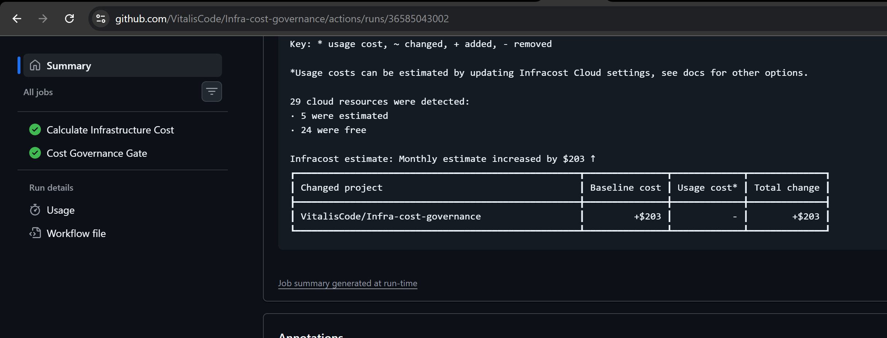
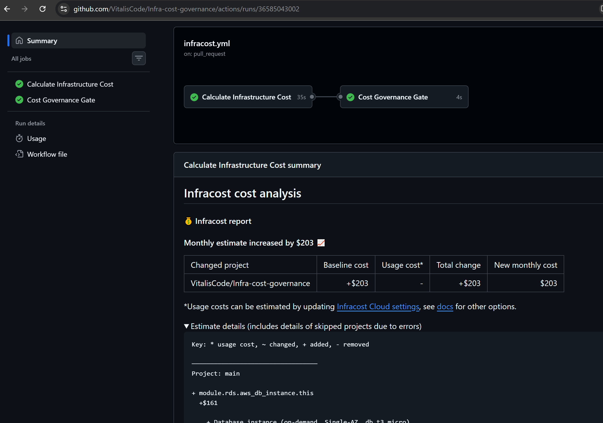

# Infra Cost Governance

This project is focused on one main goal: bringing infrastructure cost visibility into the delivery pipeline.

It provisions a small AWS workload with Terraform and uses GitHub Actions plus Infracost to show the cost impact of infrastructure changes before they are merged. The purpose is to make cloud spend visible early in the workflow, so engineering teams can reason about cost impact without treating it as a separate post-deployment concern.

This repo is not primarily a security pipeline project or a general platform governance framework. Its specific value is cost analysis in CI/CD, helping developers and reviewers understand the financial effect of infrastructure changes before apply.

## What is Infracost?

Infracost is an infrastructure cost estimation tool for Terraform and cloud infrastructure code. It reads the Terraform configuration and estimates expected cloud costs based on the resources being created or changed.

In this project, Infracost is used to:

- estimate the cost of the current branch
- compare that estimate against the main branch baseline
- show the cost delta in pull requests
- help block or flag expensive changes before they are merged

The key file for this is `infracost.yml`, which tells Infracost which Terraform project to analyze and how to structure the cost report.

## Architecture overview

          ┌──────────────────────┐
          │      Developer       │
          │ Changes Terraform    │
          └──────────┬───────────┘
                     │
                     ▼
          ┌──────────────────────┐
          │    GitHub Pull       │
          │      Request         │
          └──────────┬───────────┘
                     │
                     ▼
          ┌──────────────────────┐
          │   Terraform Plan     │
          │ fmt / validate /     │
          │ plan                 │
          └──────────┬───────────┘
                     │
                     ▼
          ┌──────────────────────┐
          │      Infracost       │
          │                      │
          │ Current vs Proposed  │
          │ infrastructure cost  │
          └──────────┬───────────┘
                     │
                     ▼
          ┌──────────────────────┐
          │ Cost Threshold Gate  │
          │                      │
          │ Increase > $25 ?     │
          └──────────┬───────────┘
                     │
             ┌───────┴────────┐
             │                │
            NO               YES
             │                │
             ▼                ▼
      ┌──────────────┐  ┌─────────────────┐
      │  cost-auto   │  │ cost-approval   │
      │              │  │                 │
      │ Continue     │  │ Manual review   │
      └──────┬───────┘  └────────┬────────┘
             │                   │
             └────────────┬──────┘
                          │
                          ▼
                 ┌──────────────────┐
                 │    PR approved   │
                 └────────┬─────────┘
                          │
                          ▼
                    Merge to main
                          │
                          ▼
                 ┌──────────────────┐
                 │ Terraform Apply  │
                 └────────┬─────────┘
                          │
                          ▼
                 ┌──────────────────┐
                 │       AWS        │
                 │                  │
                 │ VPC              │
                 │ ECS Fargate      │
                 │ S3               │
                 │ RDS              │
                 │ NAT Gateway      │
                 └──────────────────┘

## What this project deploys

The Terraform stack creates a simple production-like AWS environment:

- VPC with public and private subnets
- Internet Gateway and NAT Gateway
- ECS Fargate cluster and service
- CloudWatch log group
- RDS MySQL instance in a private subnet
- S3 bucket with versioning, encryption, and public access blocking
- Security groups for ECS and RDS

## Repository structure

- .github/workflows/ - CI/CD pipelines for plan, apply, and cost governance
- Root Terraform files and modules/ - Terraform stack and reusable child modules
- infracost.yml - Infracost project configuration

## Prerequisites

Before using the project, make sure you have:

- Terraform 1.9+ installed
- AWS credentials or an IAM role with permissions to create VPC, ECS, S3, and RDS resources
- An S3 bucket for the Terraform remote state
- You must create an Infracost account and add the API key as a GitHub repository secret named `INFRACOST_API_KEY` before the Infracost workflow can run successfully.
- A GitHub repository configured with the required secrets listed below

## GitHub Actions AWS authentication

Use GitHub Actions OIDC as the preferred AWS authentication method. OIDC exchanges a short-lived GitHub identity token for temporary AWS credentials, avoiding long-lived AWS access keys in GitHub secrets. Configure the AWS IAM OIDC provider and a role trust policy restricted to this repository and the appropriate GitHub Actions subjects, then grant the workflows `id-token: write` and configure `aws-actions/configure-aws-credentials` with `role-to-assume`.

The workflows currently use `AWS_ACCESS_KEY_ID` and `AWS_SECRET_ACCESS_KEY` GitHub secrets as a temporary troubleshooting setup. Switch them back to OIDC after resolving role assumption, and revoke/rotate any static keys used for this test. Never commit credential values.

Other required GitHub repository Actions secrets:

- `TF_STATE_BUCKET` - the S3 bucket used for Terraform remote state
- `INFRACOST_API_KEY` - the API key for Infracost Cloud used by the cost analysis workflow

For the temporary static-key configuration only, also set `AWS_ACCESS_KEY_ID` and `AWS_SECRET_ACCESS_KEY` to credentials from a dedicated, least-privilege IAM user.

The database password is now managed by Amazon RDS using AWS-managed master credentials in AWS Secrets Manager, so direct `TF_RDS_PASSWORD` input is no longer required for the GitHub Actions pipeline.

## Local usage

1. Review `envs/dev.tfvars` and adjust the non-secret development values as needed.

2. Initialize the remote backend using your state bucket:

   terraform init -backend-config="bucket=<your-tf-state-bucket>"

3. Review the planned changes:

   terraform plan -var-file="envs/dev.tfvars"

4. Apply the infrastructure:

   terraform apply -var-file="envs/dev.tfvars"

5. Destroy when needed:

   terraform destroy -var-file="envs/dev.tfvars"

> The S3 backend is required for this repo. You must provide the bucket name during init because it is not checked into the repository as a secret.

## CI/CD behavior

This repository has three main GitHub Actions workflows:

- Terraform Plan: runs on pull requests and validates formatting, init, and plan output
- Infracost Cost Governance: compares the PR branch against the main branch and blocks cost increases above the threshold
- Terraform Apply: runs on pushes to main and deploys the infrastructure to AWS

## Cost approval gate

The threshold is defined in the workflow as `COST_THRESHOLD` and is compared against the calculated monthly cost increase:

```yaml
env:
  COST_THRESHOLD: 25
```

The evaluation logic is:

```yaml
if [ "$COST_INCREASE_INT" -gt "$COST_THRESHOLD" ]; then
  echo "environment=cost-approval" >> "$GITHUB_OUTPUT"
else
  echo "environment=cost-auto" >> "$GITHUB_OUTPUT"
fi
```

This does not by itself pause the workflow. The actual manual approval happens through a GitHub Environment named `cost-approval` that must be configured in the repository with required reviewers or approval rules enabled.

In other words:

- `cost-auto` means the increase is within budget and the workflow continues normally
- `cost-approval` means the increase is above budget, and GitHub will only stop for review if the `cost-approval` environment has protection rules configured

Without that environment protection, the workflow will still set the environment name, but it will not show a reviewer approval step.

## GitHub environment setup for manual approval

To make the `cost-approval` gate work as an actual pause for review, create and configure the GitHub Environment in the repository:

1. Go to the repository in GitHub.
2. Open `Settings`.
3. Select `Environments` from the left navigation.
4. Click `New environment`.
5. Name the environment exactly `cost-approval`.
6. Enable `Required reviewers` and add the users or teams that should approve cost overruns.
7. Optionally enable a `Wait timer` if you want a short delay before the next step continues.
8. Save the environment.

Once this environment exists with protection rules, a PR whose cost exceeds the configured threshold will pause at the `cost-gate` job until an approver approves it.

## Screenshots

### Infracost cost summary



### Workflow run overview




## Notes

- The root Terraform configuration keeps AWS tags consistent across all resources.
- The RDS password is now managed securely by Amazon RDS through AWS Secrets Manager, using AWS-managed master credentials rather than Terraform-managed values.
- The Terraform version in this repo is pinned to 1.9+ to align with the provider versions.

## Quick validation command

To validate the stack locally without a live AWS backend connection (use dummy AWS credentials only for smoke testing):

  terraform init -backend=false -reconfigure
  AWS_ACCESS_KEY_ID=dummy AWS_SECRET_ACCESS_KEY=dummy AWS_DEFAULT_REGION=us-east-1 terraform validate

This confirms the configuration is syntactically valid before you deploy it to AWS.
